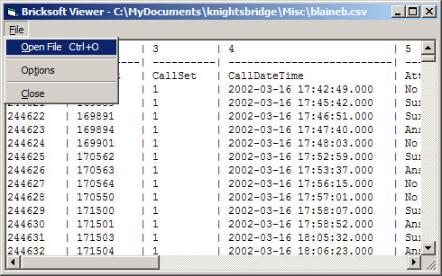



## CSV File Viewer

### Description

This simple application will display CSV files (read-only) in a simple user-interface.

At my work we use hundreds of small CSV files daily. I created this to replace Microsoft Excel because: it loads quicker, reads the CSV files with multiple double-quotes per column correctly, and doesn't reformat dates.

This DOES NOT use the built-in Visual Basic features for parsing the CSV files, either. The biggest problem with the Visual Basic methods is that you can’t tell when you reach the end of the line and therefore can’t effectively tell how many columns there are in each line. So, a complete (and thoroughly tested) CSV parser was created from scratch.

Great care has been taken to make this a complete application. Within this code you’ll also find how to do proper window-position saving, including when the application is closed while maximized, and more.

Let me know what you think!

Kody
 
### More Info
 
On my Athlon 1800 (1GB RAM), I can load a file of 30 columns, with about 4,000 lines, in just a few seconds. But, I've noticed on the slower machines at work it can really slow down depending on the number of columns/rows. That is why I added the MAXLINES feature just in case. Set it appropriately for the speed/ram of your system.

             |
---                |---
**Submitted On**   |2002-05-30 01:50:26
**By**             |[Kody Brown](https://github.com/Planet-Source-Code/PSCIndex/blob/master/ByAuthor/kody-brown.md)
**Level**          |Intermediate
**User Rating**    |5.0 (65 globes from 13 users)
**Compatibility**  |VB 6\.0
**Category**       |[Complete Applications](https://github.com/Planet-Source-Code/PSCIndex/blob/master/ByCategory/complete-applications__1-27.md)
**World**          |[Visual Basic](https://github.com/Planet-Source-Code/PSCIndex/blob/master/ByWorld/visual-basic.md)
**Archive File**   |[CSV\_File\_V883295302002\.zip](https://github.com/Planet-Source-Code/kody-brown-csv-file-viewer__1-35268/archive/master.zip)

